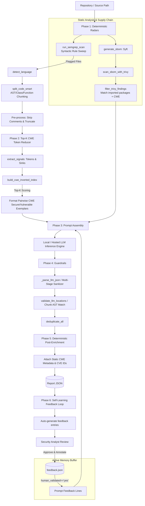

---

In last article, we went through SAST/LLM playbook which was introductory of what we will learn today in technical depth.

**VulnBlend-Scan** uses **Neuro-Symbolic architecture**. In this pipeline, open-source static tools (like Semgrep and Trivy) are utilized as high-speed, deterministic "radars" to surface hot areas. The LLM then acts strictly as a downstream "semantic judge" and automated remediation engine, evaluating localized dataflow, correlating package reachability, and generating minimal, verified code fixes.

---

## 1. System Architecture Flow

The pipeline executes a parallel static analysis of both source code and software supply chain components before unifying them into a constrained, context-rich prompt.



---

## 2. Core Implementation Modules

### Step 1: Deterministic Radars (Code & Dependency Reachability)

Before invoking any language model, the pipeline gathers deterministic baseline evidence across source code and dependencies:

* **Source Code Sweep (`run_semgrep_scan`):** Executes targeted rulesets to locate candidate syntactic vulnerabilities across repository files.


* **Supply Chain Context (`generate_sbom` & `scan_sbom_with_trivy`):** Generates a standardized CycloneDX 1.4 JSON SBOM using Syft and scans it with Trivy.


* **Reachability Filtering (`filter_trivy_findings`):** Retains only those dependency CVEs that map to specific CWE IDs, match the active language ecosystem, and whose vulnerable library is explicitly imported in the file under review. This filters out unreferenced dependency noise before it reaches the model.


### Step 2: Structural Ingestion & Smart Chunking

Raw text slicing breaks lexical scoping. The ingestion layer applies structural code extraction:

* **Language Detection (`detect_language`):** Maps file extensions to their corresponding parser and token definitions.


* **Function-Level Chunking (`split_code_smart`):** Splits code along function, class, and method boundaries using language-aware regex, tracking exact `start_line` offsets for every chunk.


* **Normalization & Truncation:** The `strip_comments_and_docstrings` helper purges non-functional tokens, while `truncate_for_prompt` balances head and tail lines to preserve both interface definitions and return paths within strict context boundaries.


### Step 3: Top-K CWE Token Reducer (Hybrid RAG)

Enterprise code span hundreds of CWE definitions and variants. Injecting an entire vulnerability catalog into a prompt degrades attention and overflows token budgets. VulnBlend implements a negative-weighted sparse index to drop irrelevant rules:

* **Signal Extraction (`extract_signals`):** Tokenizes the target code chunk to extract function identifiers, method calls, and literals.


* **Inverted Indexing (`build_cwe_inverted_index`):** Pre-indexes CWE exemplars into `{token → CWE → weight}`. Matching vulnerable patterns awards a positive weight (+2), while matching secure coding patterns and sanitizers subtracts weight (-1).


* **Dynamic Selection (`select_cwes_for_chunk`):** Evaluates token overlap and selects only the Top-K highest-ranking CWE candidates exceeding a minimum threshold score, falling back to defaults only if weak signals are present.


### Step 4: Semantic Triage & Prompt Assembly

The prompt compiler formats the extracted evidence for in-context reasoning:

* **Exemplars (`format_cwe_patterns`):** Formats the selected Top-K CWEs into concise (≤100 characters per entry) paired lists of vulnerable and secure idioms.


* **Template Hydration (`analyze_with_cwe_batch`):** Combines the code snippet, paired CWE exemplars, reachability-filtered dependency alerts, and validated human feedback into the designated mode prompt (`__LANG__`, `__CODE__`, `__CWE_PATTERNS__`, `__TRIVY_FINDINGS__`, `__FEEDBACK__`).


* **Inference Execution:** Sends the payload to the configured backend (such as a local Ollama instance or an external API) using strict JSON output formatting.


### Step 5: Guardrails & Location Verification

LLMs are probabilistic and can misidentify lines or invent variables. The post-processing stage enforces strict validation before findings are accepted:

* **Payload Sanitization (`_parse_llm_json`):** Cleans and validates raw LLM output against expected schema structures.


* **AST Substring Verification (`validate_llm_locations`):** Fuzzy-matches the reported `location` identifier and line ranges directly against the original code chunk. If the identified construct does not exist in the source, the finding is discarded.


* **Deduplication (`deduplicate_all`):** Merges duplicate alerts across adjacent chunks based on `(cwe_id, line, location)`.


---

## 3. Data Contracts & Deterministic Enrichment

To prevent the LLM from hallucinating advisory identifiers or severity ratings, the model is restricted to diagnosing the flaw, verifying dataflow, and writing the fix. Formal metadata is joined deterministically from a local dataset. For this project, I prepared dataset of around 250 CWEs for OWASP standards and its categories where vulnerability can be mapped.

### The Catalog Schema: `cwe_dataset.json`

This dataset acts as the static reference for retrieval patterns and metadata enrichment.

```json
{
  "CWE": "CWE-89",
  "Name": "SQL Injection",
  "SeverityReason": "High (code-injection risk)",
  "vulnerable_patterns": [
    {
      "code": "cursor.execute('SELECT * FROM users WHERE id = ' + user_id)",
      "explanation": "String concatenation allows SQL syntax modification."
    }
  ],
  "secure_patterns": [
    {
      "code": "cursor.execute('SELECT * FROM users WHERE id = %s', (user_id,))",
      "explanation": "Parameterized queries separate code from data."
    }
  ],
  "CVE_ID": [
    "CVE-2021-12345",
    "CVE-2022-67890"
  ]
}

```

### The Output Schema: `report.json`

The orchestrator reads the LLM's verified `cwe_id`, validates the line offsets, and appends the static metadata from `cwe_dataset.json`.

```json
{
  "file_path": "src/db.py",
  "language": "python",
  "vulnerabilities": [
    {
      "cwe_id": "CWE-89",
      "line": "42",
      "location": "execute(query)",
      "explanation": "Unparameterized SQL concatenation detected.",
      "fix_code": "cursor.execute('SELECT ... WHERE id = %s', (id,))"
    }
  ]
}

```

---

## 4. The Self-Learning Feedback Loop

Standard static tools require teams to manually draft and maintain complex custom rules or exclusion files to permanently silence recurring false alarms. VulnBlend handles this through an Active Memory Buffer that incorporates human verification into future triage passes.

```
Scan Run ──► update_feedback_with_semgrep ──► feedback.json (human_validated="no")
                                                      │
                                            Security Engineer Review
                                                      │
                                                      ▼
Next Scan ◄── load_feedback (human_validated=="yes") ─┴── status: "llm_fp"

```

### Active Feedback Workflow

1. **Automated Logging:** Following each scan, `update_feedback_with_semgrep` writes candidate findings to `feedback.json` with an initial status of `correct`, `llm_fp`, or `llm_fn`, and marks `human_validated="no"`.


2. **Analyst Review:** A security engineer inspects flagged issues. If the model misidentified an internal, safe database abstraction as an injection risk, the analyst sets `status: "llm_fp"`, documents the rationale, and updates `human_validated="yes"`.


3. **Prompt Injection:** During subsequent scans, `load_feedback` reads only the entries where `human_validated=="yes"` and formats them into compact reference rules.


4. **Behavioral Adaptation:** The prompt builder places these verified decisions into the `__FEEDBACK__` placeholder. When the LLM encounters the same internal pattern, it follows the analyst's prior resolution and skips the false alarm, allowing the system to align with organization-specific coding conventions without model retraining.


### The Feedback Contract: `feedback.json`

```json
{
  "language": "python",
  "cwe_id": "CWE-89",
  "line": "42",
  "location": "execute(query)",
  "explanation": "unparameterized SQL concatenation",
  "suggested_fix": "use placeholders",
  "fix_code": "cursor.execute('SELECT ... WHERE id = %s', (id,))",
  "status": "llm_fp",
  "comments": "Internal execute wrapper handles parameterization automatically under the hood.",
  "human_validated": "yes"
}

```

---

## 5. Deployment Orchestration

The pipeline is driven through a unified CLI and configuration file:

```bash
python3 endtoend_triage.py --config config.yml

```

```yaml
source: ./target_repo
semgrep_rules: ./cwe_rules
cwe_db: ./cwe_dataset.json
enable_trivy: true
cache_expiry_days: 7

llm:
  enabled: true
  provider: ollama        
  model: llama3-8b
  base_url: http://localhost:11434/v1
  temperature: 0.0
  max_tokens: 2048

batch_size: 4
max_context_lines: 40
out_report: out/report.json
out_feedback: feedback.json
existing_feedback: feedback.json

```

## 6. KPI evaluated in local

Macro F1: 0.779

Micro F1: 0.800

    Precision (macro/micro): 0.810 / 0.833

    Recall (macro/micro): 0.750 / 0.769

    Groundedness rate: 0.917

    Fix applicability rate: 0.833

    Overlap leverage: 0.417

Counts: {'truth_total': 13, 'pred_total': 12, 'truth_matched': 10, 'pred_matched': 10}


By decoupling deterministic static filtering from semantic LLM triage, VulnBlend takes advantage of the speed of tools like Semgrep and Trivy while utilizing language models where they excel: evaluating context, suppressing false positives, and generating actionable remediations directly within developer workflows.

Note : 
 - This architecture is intentionally designed around accessible, battle-tested open-source tools (Semgrep OSS CLI, Aqua Security's Trivy, Anchore's Syft, and Ollama/llama.cpp for local inference). You can clone these utilities, run them via standard CLI commands on any workstation or air-gapped machine without license fees, and experiment with every step of this pipeline yourself.
 - code is increasingly commoditized, so this guide focuses system design over copy-paste source. Internalize the workflow and construct the pipeline yourself to master it. Keep in mind this foundation has room to grow—current AST chunking is limited to isolated functions or classes, and the fix applicability rate requires optimization.
