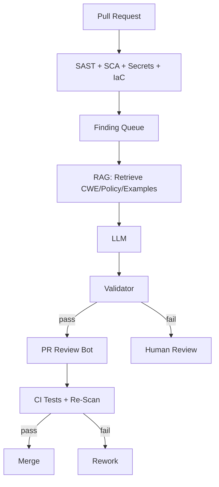

---

## Continuation — productionizing the hybrid approach

This article builds on our **LLM‑Augmented SCA** design and shows **how to run it in production** with reliability, privacy, and measurable accuracy. We cover trust boundaries, privacy-safe retrieval, CI/CD wiring, auto-fix workflows, and continuous evaluation.

---

## Reference pipeline



**Trust boundaries**  
- **Static tools** are authoritative for facts (file, line, rule, version).  
- **LLM** proposes interpretation and fix; never bypasses tests or code review.  
- **Validator** enforces schema, policy, and safety gates.

---

## Retrieval (RAG) done right

- Index **CWE entries**, **secure coding recipes**, and **org policies** into a vector store.  
- Retrieve top-k snippets for each finding; pass as **ground truth** to the LLM.  
- Keep snippets **short and source-cited** in the PR comment.  
- Cache frequent pairs (`rule_id` ↔ `CWE`) to save tokens and speed up CI.

---

## Output schema (expanded)

```json
{
  "cwe": ["CWE-79"],
  "labels": ["injection", "xss", "web"],
  "verdict": "exploitable",
  "confidence": 0.88,
  "priority": "P1",
  "explain": "Unescaped user input rendered in template.",
  "fix": {
    "patch": "escape variable or use safe templating helper",
    "code_diff": "...",
    "tests": ["assert encode('<script>') is escaped"]
  },
  "references": [
    {"title": "CWE-79", "url": "https://cwe.mitre.org/data/definitions/79.html"},
    {"title": "Org XSS Guide", "url": "https://internal/wiki/xss"}
  ]
}
```

**Validator** checks: JSON schema, max diff size, allowed files, forbidden APIs (e.g., `eval`), and labels. If missing, route to analyst.

---

## PR integration pattern

- Post a **single threaded comment** per PR summarizing grouped findings.  
- For each fix suggestion, attach **small diff** behind a “Apply Patch” button (Git apply or GitHub suggestion block).  
- Include **why** (CWE) + **what** (patch) + **tests** (copy‑paste ready).  
- Close the loop: after merge, **re-scan** and archive the ticket if clean.

---

## Handling dependency CVEs (SCA) with context

- Link **SBOM** entries to CVEs and **EPSS/KEV**.  
- Ask LLM: “Is this dependency actually loaded in prod? What code paths use it? Is a safer upgrade available?”  
- If EOL or only vulnerable with certain feature flags, the LLM highlights **conditions**; static tool verifies with config search.  
- Output: “Upgrade `openssl` to 3.0.14; image base `ubuntu:20.04` backports the fix — verify with `apt-cache policy`.”

---

## Guardrails against hallucinations

- **Schema-first**: the bot can only return allowed fields.  
- **Citations required**: any CWE claim must include a source snippet id.  
- **No silent code changes**: diffs require tests and reviewer approval.  
- **Confidence gates**: below threshold → no autofix, analyst review.  
- **Golden set**: nightly replay against labeled findings to detect drift.

---

## Privacy & IP protection

- Prefer **self-hosted models** for sensitive code.  
- Mask secrets and customer data in prompts; use **prompt firewalls** to block exfil (no URLs outside allowlist).  
- Log and sign prompts/responses for audit.  
- Time-limit data retention; encrypt at rest/in transit.

---

## Metrics that matter

- **Precision/Recall** per CWE family.  
- **False positive rate** before vs after LLM triage.  
- **Mean time to developer action** (comment-to-commit).  
- **Autofix acceptance rate** and **test pass rate**.  
- **Coverage**: % of findings with CWE mapping and fix suggestion.

---

## Example: Auto-fix with test (Java)

**Finding (SAST):** `PreparedStatement` built via string concat.  
**LLM output:** CWE-89 (SQLi), patch uses parameterized query + adds unit test with `' OR '1'='1`.  
**CI:** runs tests and SAST again → clean → merge.

---

## Rollout plan (safe and incremental)

1) Start **advisory mode**: LLM suggests fixes, no code changes.  
2) Enable **suggested diffs** behind a feature flag for low-risk rules.  
3) Expand to **autofix** for well-understood patterns (XSS auto-escape, header hardening).  
4) Periodic **prompt + rule tuning** using golden set results.

---

## Closing

Use static tools for **facts and flows**; use LLMs for **context, prioritization, and explainable fixes**. Wire them together with strict schemas, validators, and CI tests. That’s how you get **high accuracy**, **low noise**, and **true shift‑left** in day‑to‑day development.
